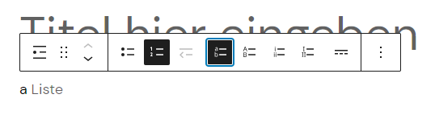

# Verwendung

Dieses Plugin ergänzt den vorhandenen Listen-Block im Block Editor um neue Funktionen. Diese sind im Block Editor am Block zu finden.

## Verschachtelte Liste verwenden

1. Gehe im WordPress-Backend unter "Seiten" auf "Neue Seite erstellen".
2. Füge dort den Block "Liste" hinzu.
3. Der Block Editor wird nun zunächst den ersten Listenpunkt hervorheben. Klicke in der Kontrollleiste auf den linken
   Button um zum "Übergeordneten Block" zu gelangen.
4. Hier findest Du die zentralen Möglichkeiten, um die Ergänzungen dieses Plugins am Block zu verwenden. Klicke auf eines
   der 4 ergänzten Symbole, um die Liste entsprechend zu formatieren.
5. In den Block-Einstellungen rechts findest Du weitere Möglichkeiten um das Verhalten der Liste zu beeinflussen
   unter "Erweiterte Listeneinstellungen".

## Screenshots

